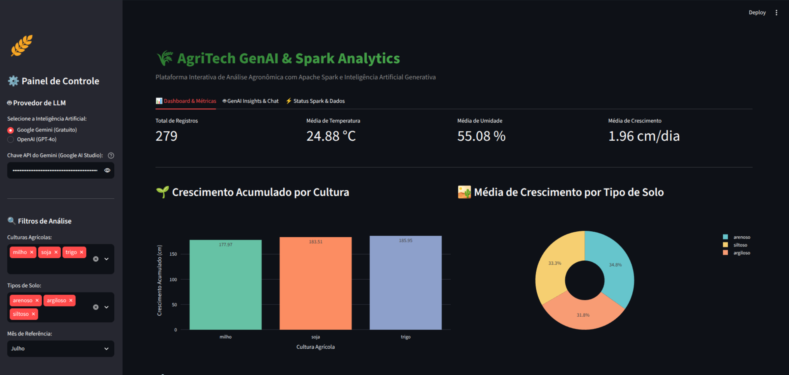

# Modelagem de Crescimento Agrícola com Apache Spark, Streamlit e GenAI (Gemini Gratuito / OpenAI)

> ⚠️ **Aviso Importante:** Todos os dados, métricas e informações contidos neste projeto são **100% fictícios**. Este repositório foi desenvolvido estritamente para uso pessoal, fins de estudo e composição de portfólio profissional.

Este projeto implementa uma solução completa de **Analytics e IA Generativa (GenAI Dashboard)** utilizando **Apache Spark (PySpark)**, **Streamlit** e **Modelos de Linguagem (LLM)** como **Google Gemini (Gratuito)** ou **OpenAI GPT-4o** para processamento, visualização e geração de insights agronômicos a partir de dados sobre o crescimento de culturas agrícolas (*milho*, *soja*, *trigo*).




---

## 📌 Fluxo Automatizado de Execução

Quando os containers são iniciados pelo **Docker Compose**:

1. **Inicialização do Cluster Spark**: O nó mestre `spark-master-dsa` e os `spark-worker-dsa` sobem e estabelecem a rede do cluster.
2. **Processamento do Job PySpark**: O container `streamlit-app` aguarda a integridade do cluster e executa automaticamente o job de dados em PySpark (`main.py`).
3. **Inicialização do Streamlit Dashboard**: Assim que o processamento do Spark é concluído com sucesso, a interface interativa em Streamlit é inicializada na porta **`8501`**.

---

## 🏗️ Arquitetura da Solução Containerizada

O ambiente de execução é totalmente orquestrado via **Docker Compose**:

- **`streamlit-app`**: Processa a job do Spark (`main.py`) e em seguida disponibiliza o Dashboard Web e Playground GenAI (Porta `8501`).
- **`spark-master-dsa`**: Nó mestre do Spark responsável por gerenciar as tarefas do cluster (UI Web na porta `9090`).
- **`spark-worker-dsa`**: Nós de processamento (*Workers*) configurados para escalabilidade horizontal.
- **`spark-history-dsa`**: Servidor de histórico de execução de tarefas do Spark (UI Web na porta `18080`).

---

## 🔑 Como Obter e Usar a Chave Gratuita do Gemini

Para utilizar o modelo **Google Gemini** gratuitamente:

1. Acesse o **[Google AI Studio](https://aistudio.google.com/)**.
2. Faça login com sua conta do Google.
3. Clique em **"Get API key"** e em seguida em **"Create API key"**.
4. Copie a chave gerada.

---

## ⚙️ Configuração da Chave da API

Você pode definir a chave de duas maneiras:

### Opção 1: Diretamente na Interface Web Streamlit (Recomendado)
Na barra lateral esquerda da aplicação em `http://localhost:8501`, selecione **Google Gemini (Gratuito)** ou **OpenAI** e cole sua chave API no campo correspondente.

### Opção 2: Via Arquivo `.env.spark`
Edite o arquivo `.env.spark`:

```env
LLM_PROVIDER=gemini
GEMINI_API_KEY=SUA_CHAVE_GEMINI_AQUI
```

---

## 📁 Estrutura do Repositório

```text
.
├── config/
│   ├── log4j2.properties    # Ajustes de nível de log do Apache Spark
│   └── spark-defaults.conf   # Parâmetros padrão e apontamentos do Spark Master/Events
├── datasets/
│   └── dataset.csv          # Conjunto de dados agrícolas (data, cultura, solo, temp, umidade, crescimento)
├── projetos/
│   ├── app.py               # Dashboard Web em Streamlit com gráficos Plotly e Chat GenAI
│   └── main.py              # Job PySpark para processamento e análises
├── requirements/
│   └── requirements.txt     # Dependências (Streamlit, Plotly, PySpark, OpenAI, Google Generative AI, etc.)
├── .env.spark               # Variáveis de ambiente (LLM_PROVIDER, GEMINI_API_KEY, etc.)
├── Dockerfile               # Construção da imagem Spark + Streamlit (Python 3.11 + OpenJDK 11 + Spark 3.5.3)
├── docker-compose.yml       # Orquestração dos containers (Master, Workers, History Server e Streamlit App)
├── entrypoint.sh            # Script de entrada sequencial (Spark Job -> Streamlit App)
├── sample.png               # Screenshot do Dashboard Interativo Streamlit
└── README.md                # Documentação completa do projeto
```

---

## 🚀 Como Executar o Projeto

### 1. Iniciar o Cluster e o Fluxo de Dados + Streamlit
Abra o terminal na pasta raiz do projeto e execute:

```bash
docker compose -f docker-compose.yml up -d --scale spark-worker-dsa=2
```

### 2. Acessar os Serviços Web

Após a conclusão do processamento do Spark, acesse em seu navegador:

- 🌾 **Dashboard Streamlit Interativo**: [http://localhost:8501](http://localhost:8501)
- ⚡ **Spark Master UI**: [http://localhost:9090](http://localhost:9090)
- 📜 **Spark History Server**: [http://localhost:18080](http://localhost:18080)

### 3. Encerrar os Containers
Para parar e remover todos os serviços:

```bash
docker compose -f docker-compose.yml down
```
